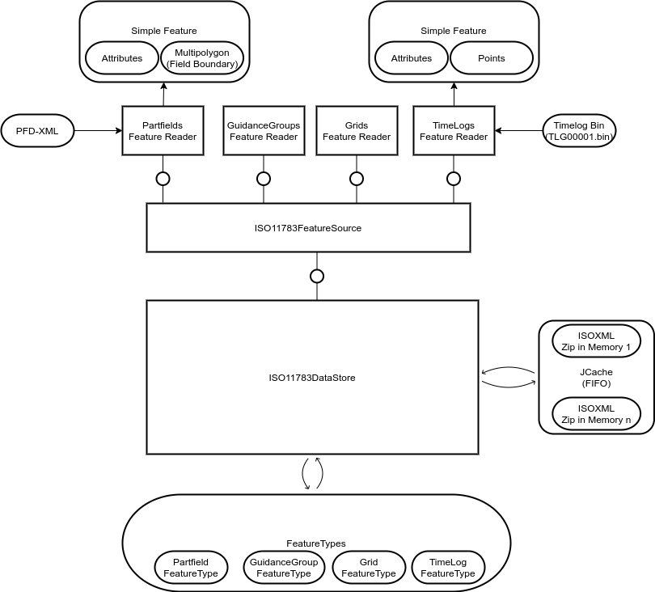

# architecture-iso-11873-part-10

This repository contains the architecture for a geoserver that can processes and show ISO 11783 (a.k.a ISOXML from ISOBUS) data as a MapBox Vector Tile layer.

# General architecture

# GitHub repo structure

# ISOXML DataStore Structure

# ISOXML Layer Mapping

# JAXB Java Classes

